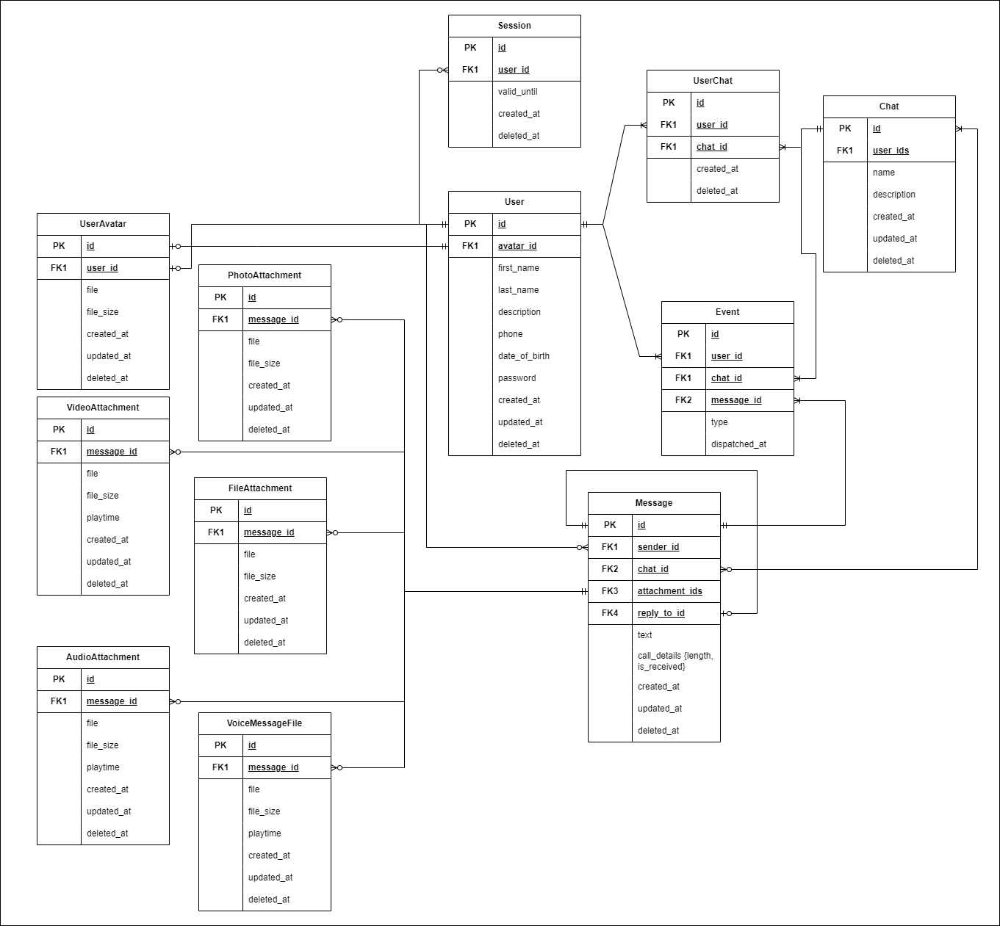
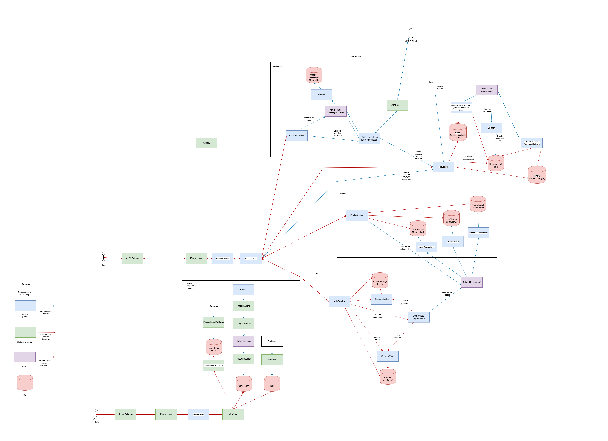

<h1>WhatsApp</h1>

<h2>ДЗ1</h2>

<h3>Целевая аудитория</h3>

Более 2.9 млрд по всему миру, более 2 млрд MAU за 2024 год, 1.66 млрд DAU [1]. Самое большое количество пользователей - в Индии (535.8 млн), далее идут Бразилия (139.3 млн),
США (91.3 млн). В РФ активных пользователей WhatsApp 66.7 млн. [2]

<h3>Ключевые продуктовые решения</h3>
<ol>
    <li>Сервис максимально ориентирован под мобилки, изначально WhatsApp был задуман как замена SMS [3]</li>
    <li>После подтвержденного получения сообщения сервер стирает отправленное сообщение из памяти, оно хранится на клиенте [4]</li>
</ol>

<h3>Ключевой функционал</h3>
<ol>
    <li>Зарегистрироваться/войти по номеру телефона</li>
    <li>CRUD сообщений (read - читать диалог)</li>
    <li>CRUD групповых чатов</li>
    <li>Просмотреть список диалогов</li>
    <li>Найти пользователя по номеру телефона</li>
    <li>Отправить вложение (фото/видео/аудио/файл/голосовое сообщение)</li>
    <li>Аватарки пользователей (статические картинки)</li>
    <li>Аудиозвонки</li>
</ol>

<h3>Список использованных источников</h3>
<ol>
    <li>https://analyzify.com/statsup/whatsapp</li>
    <li>https://worldpopulationreview.com/country-rankings/whatsapp-users-by-country</li>
    <li>https://www.whatsapp.com/about</li>
    <li>https://highscalability.com/the-whatsapp-architecture-facebook-bought-for-19-billion/</li>
</ol>

<h2>ДЗ2</h2>

<h3>Продуктовые метрики</h3>

<h5>MAU - 2 млрд</h5>

<h5>DAU - 1.66 млрд</h5>

<h5>Средний размер пользовательских хранилищ</h5>

<table>
    <thead>
        <th>Тип хранилища</th>
        <th>Средний объем на 1 пользователя</th>
    </thead>
    <tbody>
        <tr>
            <td>Текстовые сообщения</td>
            <td>90 bil (approximately) / 3 bil = 30 messages a day per user, about 15 Kb a day per user, *365 a year (by 2024), 0.41 of that a year avg since 2010 (average MAU since 2010 is 0,41 of that in 2024), * 15 years passed = * 6.27 a year avg, total = 15 * 365 * 6.27 * 15 Kb per user = 21900 Kb per user = <b>4.19 MB</b> per user</td>
        </tr>
        <tr>
            <td>Голосовые сообщения</td>
            <td>150 mil a day / 3 bil, 0.05 per user a day, 20 sec avg [1], 1 sec per user per day avg, 365 * 6.27 secs per user total, WhatsApp typically uses the Opus codec for voice messages, which has a bitrate of around 16 kbps (kilobits per second), so 16 * 365 * 6.27 Kb per user total = <b>4.47 MB</b> per user</td>
        </tr>
        <tr>
            <td>Медиа-файлы</td>
            <td>10 bil total media a day,  / 3 bil users, max img size = 5 MB, let avg be 1 MB, 10 / 3 MB per user per day, (10/3) * 365 * 6.27 MB per user total = <b>7.45 GB</b></td>
        </tr>
    </tbody>
</table>

<h5>Среднее кол-во действий пользователя по типам в день</h5>

<table>
    <thead>
        <th>Тип действия</th>
        <th>Среднее кол-во действий в день</th>
    </thead>
    <tbody>
        <tr>
            <td>Просмотр списков диалогов</td>
            <td>34.19 billion total annual visits in 2021, 2.13b users in 2021, 2.9b in 2024, 34.19 * 6.27 billion total annual visits in 2024, * 1/365 [3] = 34.19 * 2.9 / 365 / 2.13 bil = <b>127 mil</b></td>
        </tr>
        <tr>
            <td>Поиск чата по номеру телефона</td>
            <td>Let 1 in 200 messages is to new user, 100 bil / 150 = <b>500 mil</b></td>
        </tr>
        <tr>
            <td>Отправка сообщений</td>
            <td><b>100 bil</b>[2]</td>
        </tr>
        <tr>
            <td>Отправка сообщений с вложениями</td>
            <td> 6.9 billion images are shared on WhatsApp chat each day [3], <b>10 bil total attachments</b>
            </td>
        </tr>
        <tr>
            <td>Отправка голосовых сообщений</td>
            <td><b>150 mil</b> a day [1]</td>
        </tr>
        <tr>
            <td>Отправка сообщений в групповых чатах</td>
            <td>57.5% of all messages are sent in groups with more than two participants https://analyzify.com/statsup/whatsapp. 100 bil * 57.5% = <b>57.5 bil</b></td>
        </tr>
        <tr>
            <td>Аудиозвонки</td>
            <td>Almost 2 billion minutes are spent each day on WhatsApp calls [3] 120 bil secs / 182 secs avg voice call = <b>659 mil</b> voice calls avg</td>
        </tr>
    </tbody>
</table>

<h3>Технические метрики</h3>

<h5>Размер хранения в разбивке по типам данных</h5>
<table>
    <thead>
        <th>Тип хранилища</th>
        <th>Объем хранилища по типам данных, Тб</th>
    </thead>
    <tbody>
        <tr>
            <td>Текстовые сообщения</td>
            <td>11 973 TB</td>
        </tr>
        <tr>
            <td>Голосовые сообщения</td>
            <td>12 789 TB</td>
        </tr>
        <tr>
            <td>Медиа-файлы</td>
            <td>21 826 172 TB</td>
        </tr>
    </tbody>
</table>

<h5>Сетевые метрики</h5>
<table>
    <thead>
        <th>Тип запроса</th>
        <th>RPS средний</th>
        <th>RPS пиковый</th>
        <th>Пиковое потребление в течение суток (в Гбит/с)</th>
        <th>Суммарный суточный (Гбайт/сутки)</th>
    </thead>
    <tbody>
        <tr>
            <td>Отправка сообщения</td>
            <td>1 157 400</td>
            <td>2 000 000</td>
            <td>2 mil * 0.5 Kb = 10 mil Kb = <b>1 Gb/sec</b></td>
            <td>1 * (1157400/2000000) / 8 * 24 * 3600 = <b>5 956 GB/day</b></td>
        </tr>
        <tr>
            <td>Просмотр списка диалогов</td>
            <td>1471</td>
            <td>5000</td>
            <td>5000 * 1 Kb (w/out avatars) * 0.1 (client caches are hit in 90% of the requests) = 500 Kb = <b>0.00047 Gb/sec</b></td>
            <td>0.00047 * (1471/5000) / 8 * 24 * 3600 = <b>0.1493 GB/day</b></td>
        </tr>
        <tr>
            <td>Сохранение вложения</td>
            <td>110 000</td>
            <td>200 000</td>
            <td>1 MB avg attach, 200 000 * 1 * 8 / 1024 = <b>790 Gb/sec</b></td>
            <td>790 * (110000 / 200000) / 8 * 24 * 3600 = <b>4 640 328 GB/day</b></td>
        </tr>
        <tr>
            <td>Получение вложений</td>
            <td>1 просмотр диалогов = avg 1 get single dialog = 2 attach 
            * 1471 RPS get dialog = <b>2871</b></td>
            <td>6000</td>
            <td>6000 RPS * 1MB avg attach * 0.05 cache = 300 MBps * 8 / 1024  = <b>2.34 Gbps</b></td>
            <td>2.34 * (2871/6000) / 8 * 24 * 3600 = <b>12 092 GB/day</b></td>
        </tr>
        <tr>
            <td>Аудиозвонок</td>
            <td>7 627</td>
            <td>20 000</td>
            <td>2 billion minutes a day * 60 sec * 16 Kbps / (24 * 3600) = <b>21.19 Gb/sec</b></td>
            <td>21.19 * (7 627 / 20 000) / 8 * 3600 * 24 = <b>87 272 GB/day</b></td>
        </tr>
        <tr>
            <td>Голосовое сообщение</td>
            <td>150 mil / (24 * 3600) = <b>1787</b></td>
            <td>5000</td>
            <td>5000 * 16 Kbps * 20 sec avg length = 1 600 000 Kbps = <b>1.52 Gb/s</b></td>
            <td>1.52 * (1787 / 5000) / 8 * 3600 * 24 = <b>5 867 GB/day</b></td>
        </tr>
        <tr>
            <td>Поиск по телефону</td>
            <td>150 mil / (24 * 3600) = <b>1736</b></td>
            <td>5000</td>
            <td>12000 * 10 Kb = 120000 Kbps = <b>0.11 Gb/s</b></td>
            <td>0.11 * (5787 / 12000) / 8 * 3600 * 24 = <b>573 GB/day</b></td>
        </tr>
        <tr>
            <td>Логин</td>
            <td>Let once in 180 days 1 user is logged out. 1.66 bil DAU / 180 = 9 220 000 logins a day = <b>106 RPS</b></td>
            <td>400</td>
            <td>400 * 1 Kb = 400 Kbps = <b>0.0004 Gb/s</b></td>
            <td>0.0004 * (106/400) / 8 * 3600 * 24 = <b>1 GB/day</b></td>
        </tr>
        <tr>
            <td>Создание группового чата</td>
            <td>Let it happen once in 5 searches by phone: 1736 / 5 = <b>340 RPS</b></td>
            <td>1000</td>
            <td>1000 * 5 Kb = 5000 Kbps = <b>0.004 Gb/s</b></td>
            <td>0.004 * (340/1000) / 8 * 3600 * 24 = <b>17.5 GB/day</b></td>
        </tr>
    </tbody>
</table>

<h3>Список использованных источников</h3>
<ol>
    <li>https://soundbran.ch/2023/03/06/the-rise-of-voice-notes-20-statistics/</li>
    <li>https://verloop.io/blog/whatsapp-statistics-2024</li>
    <li>https://www.cooby.co/en/post/whatsapp-statistics</li>
</ol>

<h2>ДЗ3</h2>

<h3>Функциональное разбиение по доменам</h3>

<ul>
    <li>auth - авторизация и аутентификация</li>
    <li>chat - чаты</li>
    <li>call - звонки</li>
</ul>

<h3>Обоснование расположения ДЦ</h3>

Сервис имеет огромную аудиторию по всему миру, поэтому следует распределить ДЦ так, чтобы они покрывали все континенты, с фокусом на те страны, в которых находится наибольшее число пользователей. Для Северной Америки это США, для Южной Америки - Бразилия, для Европы - Германия (с высокой концентрацией и в других странах), для Азии - Индия (550 млн, наибольшая аудитория), для Африки - Нигерия. Также часть пользователей присутствует в Австралии и Океании. Если не иметь хотя бы одного ДЦ в каждом из этих регионов, то задержка для местных пользователей будет увеличена на десятки мс (вплоть до 100-150 мс) только из-за географического положения.

<table>
    <thead>
        <th>Регион</th>
        <th>Города расположения ДЦ</th>
        <th>Обоснование</th>
    </thead>
    <tbody>
        <tr>
            <td>Европа</td>
            <td>Франкфурт, Лондон, Стокгольм, Варшава</td>
            <td>ДЦ в UK будет обслуживать западную Европу (включая Францию), ДЦ в Германии - Центральную Европу, Варшава - европейская часть РФ и Восточная Европа, Стокгольм - Скандинавия</td>
        </tr>
        <tr>
            <td>Западная Азия (до Мьянмы)</td>
            <td>Астана, Дели, Бомбей, Катманду, Мадрас, Янгон</td>
            <td>Астана - Центральная Азия, азиатская часть РФ. Дели - север Индии, Пакистан. Бомбей - восток Индии, Катманду - запад Индии, Бангладеш. Мадрас - юг Индии. Янгон - Мьянма, Бангладеш.</td>
        </tr>
        <tr>
            <td>Восточная Азия + Австралия и Океания</td>
            <td>Токио, Бангкок, Дили, Канберра</td>
            <td>Токио - Дальний Восток, Япония, Южная Корея. Бангкок - Тайланд, север Индонезии. Дили - юг Индонезии, Филлипины, север Австралии. Канберра - юг Австралии, Новая Зеландия.</td>
        </tr>
        <tr>
            <td>Африка</td>
            <td>Каир, Лагос</td>
            <td>Каир - Северная Африка, ОАЭ, Лагос - Центральная и Южная Африка</td>
        </tr>
        <tr>
            <td>Северная Америка + Центральная Америка</td>
            <td>Сиэтл, Лос-Анжелес, Нью-Йорк, Мехико</td>
            <td>Сиэтл - запад Канады, Аляска, северо-запад США, Лос-Анжелес - юго-запад США, Нью-Йорк - северо-восток США, восток Канады. Мехико - Центральная Америка.</td>
        </tr>
        <tr>
            <td>Южная Америка</td>
            <td>Манаус, Рио-де-Жанейро, Буэнос-Айрес</td>
            <td>Манаус - север ЮА, Рио-де-Жанейро - центральная часть, Буэнос-Айрес - юг ЮА.</td>
        </tr>
    </tbody>
</table>

<h3>Расчет распределения запросов по датацентрам</h3>

<table>
    <thead>
        <th>Регион</th>
        <th>Нагрузка по RPS на 1 ДЦ, % от общего</th>
    </thead>
    <tbody>
        <tr>
            <td>Европа (400 mil)</td>
            <td>0.18 / 4 = 4.5%</td>
        </tr>
        <tr>
            <td>Западная Азия (до Мьянмы) (800 mil)</td>
            <td>0.36 / 6 = 6%</td>
        </tr>
        <tr>
            <td>Восточная Азия + Австралия и Океания (300 mil)</td>
            <td>0.13 / 4 = 3.4%</td>
        </tr>
        <tr>
            <td>Африка (200 mil)</td>
            <td>0.09 / 2 = 4.5%</td>
        </tr>
        <tr>
            <td>Северная Америка + Центральная Америка (300 mil)</td>
            <td>0.13 / 4 = 3.4%</td>
        </tr>
        <tr>
            <td>Южная Америка (200 mil)</td>
            <td>0.13 / 3 = 4.3%</td>
        </tr>
    </tbody>
</table>

<h3>Схема балансировки</h3>

Разумно будет использовать <b>GEO-based DNS</b> для определения IP балансировщика по регионам. Например, если есть 6 ДЦ в Западной Азии, то DNS определяет IP-адрес балансировщика для региона Азия, который распределяет нагрузку по соответствующим ДЦ.

Используем Latency-based балансировку. После определения IP регионального балансировщика через DNS балансировщик определяет ДЦ, до которого задержка минимальна, и роутит запрос в этот ДЦ.

<h2>ДЗ4</h2>

<h3>Внешние запросы</h3>
<ol>
    <li>Дошли до ЦОДа</li> 
    <li>2 * n (failure-prune) Kuber clusters with L4 balancers</li>
    <li>Redirect based on Least Connections alg to one of Kuber clusters with backends/static servers + Envoy + ssl termination</li>
    <li>Kuber balances load among the Pods using Envoy proxy</li>
    <li>Get response from service and serve it through Envoy right to client</li> 
</ol>

<h3>Внутрисервисные запросы</h3>

Используем Envoy для балансировки, Least Conn для внутрисервисных запросов

<h3>Отказоустойчивость</h3>

Засчет нескольких дублирующих друг друга кластеров Kubernetes достигается отказоустойчивость. Балансировщик должен асинхронно раз в секунду проводить health-check кластеров и обновлять список доступных кластеров в соответствии с ним. Отказоустойчивость на уровне Pod'а обеспечивается самим Кубером.

<h3>Нагрузка по терминации SSL</h3>

В среднем 4% запросов на 1 ЦОД, 4 ЦОДа на регион, 4 Kuber кластера на ЦОД. Пусть в среднем 25% запросов попадают в session cache. Тогда при 3 млн пикового RPS на 1 ЦОД приходится 120k пикового RPS, из которых 90k не попадают в кэш, требуют 2 round-trip'а. 2 ms for RSA key exchange, 2ms * 90k = 180 sec of proc time per second.

<h2>ДЗ5</h2>

<h3>Логическая схема БД (серверная сторона)</h3>

<h3>Логическая схема БД (пользовательская сторона)</h3>

<h3>Описание таблиц</h3>

<table>
    <thead>
        <th>Таблица</th>
        <th>Размеры данных</th>
        <th>Нагрузка на чтение</th>
        <th>Нагрузка на запись</th>
        <th>Консистентность</th>
    </thead>
    <tbody>
        <tr>
            <td>User</td>
            <td>4 + 4 + 2 * 10 + 2 * 10 + 2 * 20 + 2 * 12 + 64 + 4 * 8 = 208 bytes per user, 3 bil users = <b>582 GB</b></td>
            <td><b>5000 RPS</b> of uncached get dialogs</td>
            <td>100 mil users per 6 month, 3 times as much updates = 400 mil / (6 * 30 * 24 * 60 * 60) = <b>26 RPS</b></td>
            <td>When deleted, session and avatar are deleted</td>
        </tr>
        <tr>
            <td>Session</td>
            <td>2 * 4 + 4 * 8 = 40 bytes per sess * 3 bil / 1024^4 = <b>112 GB</b></td>
            <td>2 500 000 RPS</td>
            <td>400 RPS</td>
            <td>Deleted when expires, when user is deleted or logged out</td>
        </tr>
        <tr>
            <td>Chat</td>
            <td>4 + 4 * 2.5 + 10 * 2 + 10 * 2 + 3 * 8 = 78 bytes per chat * 5 chats per user * 3 bil users / 1024^4 = <b>1089 GB</b></td>
            <td>5000 RPS</td>
            <td>200 RPS</td>
            <td>-</td>
        </tr>
        <tr>
            <td>Message</td>
            <td>4 * 4 + 2 * 2 + 4 + 3 + 3 * 8 = 67 bytes per message * 100 bil a day * 365 * 10 = <b>4 448 TB</b></td>
            <td>5000 RPS</td>
            <td>2 000 000 RPS</td>
            <td>When deleted, all attachments are also deleted. If id of voice message is present in attachment_ids, then is a voice message (text and other attachments are ignored). If call_details JSON is not NULL, then message is a call info message, other info about it is ignored.</td>
        </tr>
        <tr>
            <td>UserAvatar</td>
            <td>150 KB per file, 1 in 3 users has one = 150 * 1 bil / 1024 / 1024 / 1024 = <b>139.7 TB</b></td>
            <td>Uncached Get Dialogs + search = <b>10 000 RPS</b></td>
            <td>52 RPS</td>
            <td>Deleted when user is deleted</td>
        </tr>
        <tr>
            <td>PhotoAttachment</td>
            <td>150 KB per file, 7 bil a day = 150 * 7 bil * 365 * 10 / 1024 / 1024 / 1024 = <b>3 485.64 TB</b></td>
            <td>2 Get PhotoAttachment per one uncached Get Dialog = <b>10 000 RPS</b></td>
            <td>6000 RPS</td>
            <td>Deleted when corresponding message is deleted</td>
        </tr>
        <tr>
            <td>VideoAttachment</td>
            <td>2MB per file, 5 times more rare than image, 1.4 bil a day = 2 * 1.4 bil * 365 * 10 / 1024 / 1024 = <b>9 746 551 TB</b></td>
            <td>2000 RPS</td>
            <td>1200 RPS</td>
            <td>Deleted when corresponding message is deleted</td>
        </tr>
        <tr>
            <td>FileAttachment</td>
            <td>1MB per file, 10 times more rare than image, .7 bil a day = 1 * .7 bil * 365 * 10 / 1024 / 1024 = <b>2 436 637 TB</b></td>
            <td>1000 RPS</td>
            <td>600 RPS</td>
            <td>Deleted when corresponding message is deleted</td>
        </tr>
        <tr>
            <td>AudioAttachment</td>
            <td>2MB per file, 10 times more rare than image, .7 bil a day = 2 * .7 bil * 365 * 10 / 1024 / 1024 = <b>4 873 275 TB</b></td>
            <td>1000 RPS</td>
            <td>600 RPS</td>
            <td>Deleted when corresponding message is deleted</td>
        </tr>
        <tr>
            <td>VoiceMessageFile</td>
            <td>4.47MB per user total * 3 bil / 1024 / 1024 = <b>12 788 TB</b></td>
            <td>0.0015 * 20 * Get Dialog = 0.03 * 5000 = 150 RPS</td>
            <td>5000 RPS</td>
            <td>Deleted when corresponding message is deleted</td>
        </tr>
    </tbody>
</table>

 <h2>ДЗ6</h2>

<table>
    <thead>
        <th>Таблица</th>
        <th>СУБД</th>
        <th>Индексы</th>
        <th>Шардинг</th>
        <th>Резервное копирование</th>
    </thead>
    <tbody>
        <tr>
            <td>User</td>
            <td>MongoDB + выгружать tuple (id, phone) в ElasticSearch</td>
            <td>Phone</td>
            <td>Hash by UserID</td>
            <td>Master-Slave replication</td>
        </tr>
        <tr>
            <td>Session</td>
            <td>Redis</td>
            <td>Key is UserID</td>
            <td>Hash by UserID</td>
            <td>Redis Cluster</td>
        </tr>
        <tr>
            <td>UserChat</td>
            <td>MongoDB</td>
            <td>Key is UserID, value is []ChatID</td>
            <td>Hash by UserID</td>
            <td>Backups w/BSON, дублирующие инстансы (master-slave)</td>
        </tr>
        <tr>
            <td>Chat</td>
            <td>MongoDB</td>
            <td>-</td>
            <td>Hash by ChatID</td>
            <td>Backups w/BSON, дублирующие инстансы (master-slave)</td>
        </tr>
        <tr>
            <td>Message</td>
            <td>MongoDB</td>
            <td>-</td>
            <td>Hash by ChatID (stored in same doc as Chat)</td>
            <td>-</td>
        </tr>
        <tr>
            <td>Event</td>
            <td>Kafka (split topics by UserID)</td>
            <td>-</td>
            <td>-</td>
            <td>Выгрузка в ClickHouse - сервис записи в ClickHouse делаем по дефолту консьюмером каждого топика, читаем все Events, в зависимости от поля type ('msg:received', 'msg:read' и т. д.) записываем события в соответствующие таблицы</td>
        </tr>
        <tr>
            <td>UserAvatar</td>
            <td>Hadoop</td>
            <td>-</td>
            <td>Hash by UserID</td>
            <td>Дублирующий Hadoop с периодической синхронизацией, готовый подхватить нагрузку</td>
        </tr>
        <tr>
            <td>PhotoAttachment</td>
            <td>Hadoop</td>
            <td>-</td>
            <td>Hash by ChatID</td>
            <td>Дублирующий Hadoop с периодической синхронизацией, готовый подхватить нагрузку</td>
        </tr>
        <tr>
            <td>VideoAttachment</td>
            <td>Hadoop</td>
            <td>-</td>
            <td>Hash by ChatID</td>
            <td>Дублирующий Hadoop с периодической синхронизацией, готовый подхватить нагрузку</td>
        </tr>
        <tr>
            <td>FileAttachment</td>
            <td>Hadoop</td>
            <td>-</td>
            <td>Hash by ChatID</td>
            <td>Дублирующий Hadoop с периодической синхронизацией, готовый подхватить нагрузку</td>
        </tr>
        <tr>
            <td>AudioAttachment</td>
            <td>Hadoop</td>
            <td>-</td>
            <td>Hash by ChatID</td>
            <td>Дублирующий Hadoop с периодической синхронизацией, готовый подхватить нагрузку</td>
        </tr>
        <tr>
            <td>VoiceMessageFile</td>
            <td>Hadoop</td>
            <td>-</td>
            <td>Hash by ChatID</td>
            <td>Дублирующий Hadoop с периодической синхронизацией, готовый подхватить нагрузку</td>
        </tr>
    </tbody>
</table>

На клиенте вложения хранить в Minio, другие данные - в SQLite.

<h2>ДЗ7</h2>

<h4>Поиск по телефону</h4>
<ol>
    <li>
        При создании нового пользователя асинхронно выгружать объект вида {"phone": string, "id": bigint} в Elasticsearch 
        (с унифицированным форматом скобок, дефисов и т. д.), 
        обрабатывать с помощью pattern capture token filter (разбивать на код страны, код региона, номер) https://discuss.elastic.co/t/search-phone-number/32771/3
    </li>
    <li>
        При запросе обращаться к Elasticsearch, получить ID пользователя с приоритетом тем значениям, у которых код страны совпадает с кодом пользователя, делающего запрос
    </li>
    <li>
        По Btree (unique index) найти пользователя в PostgreSQ
    </li>
</ol>

<h4>Пометка сообщений как UNRECEIVED/RECEIVED/READ</h4>
<ol>
    <li>
        Mark local msg at sender as UNRECEIVED by default
    </li>
    <li>
        Message is send through real-time connection to XMPP server and received by the Receiver(s)
    </li>
    <li>
        Message receiver(s) send req to server (chat_id, msg_id, is_read, is_received)
    </li>
    <li>
        Write it to Kafka broker to topic that Sender is subscribed to
    </li>
    <li>
        Write it to Kafka topic that Message Deletion service is subscribed to
    </li>
    <li>
        Deletion Service reads msg_id and rewrites corresponding message with empty message (to avoid changes in index)
    </li>
    <li>
        Sender pulls RECEIVED/READ event from Message Service 
    </li>
    <li>
        Message sender reads event and marks local message as RECEIVED/READ
    </li>
</ol>

<h2>ДЗ8</h2>

<table>
    <thead>
        <th>Область</th>
        <th>Технология</th>
    </thead>
    <tbody>
        <tr>
            <td>Мобильные приложения</td>
            <td>Для разработки мобильного приложения WhatsApp под Android используем Kotlin, под IOS - Swift</td>
        </tr>
        <tr>
            <td>Backend</td>
            <td>WhatsApp написан на Erlang. Засчет hotspot-замены кода, Actor-архитектуры и встроенной мультипоточности Erlang является хорошим решением.
    Кроме того, набор библиотек OTP предоставляет функционал для реализации IP-телефонии и real-time сообщений из коробки. В зависимости от условий (есть ли у нас штат разработчиков либо мы формируем его с нуля),
    возможно, лучшим решением будет использовать Golang, т. к. рынок Erlang разработчиков не предоставляет столь же широкого выбора.</td>
        </tr>
        <tr>
            <td>Secrets management</td>
            <td>Confidant - популярное open-source решение</td>
        </tr>
        <tr>
            <td>Real-time сообщения</td>
            <td>Для реализации сообщений в реальном времени используем протокол XMPP.
    Он хорошо масштабируется - не нужно централизованного сервера, который принимает и отправляет сообщения (как с WebSocket),
    можно поднять множество децентрализованных серверов и распределить по ним пользователей. Кроме того, существует open-source сервер EJabberd, написанный на Erlang,
    который можно будет доработать в случае необходимости. С помощью XMPP-серверов можно реализовать VoIP.</td>
        </tr>
        <tr>
            <td>Аудиозвонки</td>
            <td>Используем протокол VoIP. Для установки соединения можно использовать расширение Jingle (XEP-0166) для XMPP.
    После обмена XMPP-сообщениями для установки соединения будет использован протокол RTP (Real-time Transport Protocol)
    для голосового звонка. Для завершения звонка клиент должен отправить соответствующее XMPP-сообщение.</td>
        </tr>
        <tr>
            <td>Система логирования и мониторинга отказов</td>
            <td>
                Для сбора и анализа логов и алертов используем стек Grafana Loki (Promtail, Loki, Grafana). 
                Его преимущество относительно стека ELK (ElasticSearch, Logstash, Kibana) - хранение в индексах только метаинформации о логах, 
                в отличии от полнотестового поиска по логам, принятого в ELK. Это позволяет нам существенно экономить объемы хранилищ за счет уменьшения индексов.
            </td>
        </tr>
        <tr>
            <td>Трейсинг</td>
            <td>
                Для трейсинга запросов будем использовать Jaeger. 
                Для отображения и аналитики по трассированым запросам можно использовать Grafana.
            </td>
        </tr>
        <tr>
            <td>Оркестрация</td>
            <td>Для оркестрации на физических машинах будем использовать Kubernetes.</td>
        </tr>
        <tr>
            <td>Нагрузочное тестирование</td>
            <td>Для тестирования проекта под высокой нагрузкой используем Apache JMeter.</td>
        </tr>
        <tr>
            <td>Управление конфигурацией</td>
            <td>
                Для управления конфигурацией проиложения на серверах будем использовать Ansible. 
                С помощью Ansible можно также раскатывать конфиги для Kubernetes и Envoy.
            </td>
        </tr>
    </tbody>
</table>

<h2>ДЗ9</h2>

<h3>Схема проекта</h3>

<h2>ДЗ10</h2>

<h3>Алгоритмы для отказоустойчивости</h3>
<ol>
    <li>Graceful shutdown для обработки файлов - перед тем, как завершиться, сохранить необработанные файлы в unprocessed</li>
    <li>Graceful degradation для обработки файлов - сохранять в unprocessed, если упали процессоры</li>
    <li>Ретрай регистрации с клиента в случае 500</li>
    <li>Всегда показывать списки чатов и сами чаты с клиента</li>
    <li>redis fails - Memcached is read from</li>
    <li>preview mechanism for media</li>
    <li>retry unreceived messages from Cassandra</li>
</ol>

<h2>ДЗ11</h2>
Erlang Benchmark - https://stressgrid.com/blog/webserver_benchmark/
80k RPS

<table>
  <thead>
    <tr>
      <th>Сервис</th>
      <th>Целевая пиковая нагрузка приложения</th>
      <th>CPU</th>
      <th>RAM</th>
      <th>Net</th>
    </tr>
  </thead>
  <tbody>
    <tr>
      <td>auth</td>
      <td>2 500 000 RPS</td>
      <td>5000</td>
      <td>5000 Gb</td>
      <td>30 Gbit/s</td>
    </tr>
    <tr>
      <td>profile</td>
      <td>5000 RPS</td>
      <td>16</td>
      <td>16 Gb</td>
      <td>1 Gbit/s</td>
    </tr>
    <tr>
      <td>messages</td>
      <td>2 000 000 connections</td>
      <td>40</td>
      <td>400 Gb</td>
      <td>840 Gbit/s</td>
    </tr>
    <tr>
      <td>files</td>
      <td>200 000 RPS</td>
      <td>400</td>
      <td>400 Gb</td>
      <td>800 Gbit/s</td>
    </tr>
    <tr>
      <td>metrics</td>
      <td>500 RPS</td>
      <td>8</td>
      <td>8 Gb</td>
      <td>1 Gbit/s</td>
    </tr>
  </tbody>
</table>

Для каждого сервиса подбираем конфигурацию сервера и хостинг

<table>
  <thead>
    <tr>
      <th>Название</th>
      <th>Хостинг</th>
      <th>Конфигурация</th>
      <th>Cores</th>
      <th>Cnt</th>
      <th>Покупка</th>
      <th>Аренда</th>
    </tr>
  </thead>
  <tbody>
    <tr>
      <td>kubenode</td>
      <td>own</td>
      <td>2x6338/16x32GB/2xNVMe4T/2x25Gb/s</td>
      <td>64</td>
      <td>50 (32 без резервирования)</td>
      <td>$1,624,000</td>
      <td>$26,992/мес</td>
    </tr>
  </tbody>
</table>

Для сервисов в оркестрации:

<table>
  <thead>
    <tr>
      <th>Сервис</th>
      <th>CPU</th>
      <th>RAM</th>
      <th>Cnt</th>
    </tr>
  </thead>
  <tbody>
    <tr>
      <td>auth</td>
      <td>8</td>
      <td>32 Gb</td>
      <td>160</td>
    </tr>
    <tr>
      <td>profile</td>
      <td>8</td>
      <td>32 Gb</td>
      <td>40</td>
    </tr>
    <tr>
      <td>messages</td>
      <td>16</td>
      <td>200 Gb</td>
      <td>40</td>
    </tr>
    <tr>
      <td>files</td>
      <td>8</td>
      <td>32 Gb</td>
      <td>60</td>
    </tr>
    <tr>
      <td>metrics</td>
      <td>8</td>
      <td>32 Gb</td>
      <td>40</td>
    </tr>
  </tbody>
</table>
